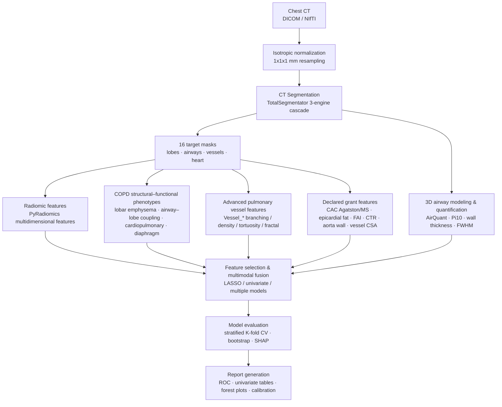

# COPD Cardiopulmonary Imaging Phenotyping & Risk Prediction

A chest CT imaging phenotyping and cardiopulmonary-event risk prediction study for chronic airway diseases (COPD / bronchiectasis / asthma). This repository implements the full computational pipeline from **CT image segmentation → radiomics & structural–functional feature extraction → multimodal fusion modeling → explainable reporting**, and is the algorithmic implementation and data-analysis component of the Beijing Natural Science Foundation – Daxing Joint Innovation Fund key project *L256014 "Integrating Cardiopulmonary Imaging with Multidimensional Clinical Features to Predict Cardiopulmonary Events in Patients with Chronic Airway Disease"*.

## 📌 Quick Links / 快速导航

| 链接 | 内容 |
|---|---|
| 📖 **研究说明 / Study overview** | [docs/README.md](docs/README.md) — 队列 / 标签口径 / 特征工程 / 方法 / 结果汇总 / 结论局限 |
| 🧪 **分析脚本与使用规范** | [Analysis/README.md](Analysis/README.md) — 22 个正式可复用脚本、用法、执行流程 ①→⑦ |
| 🇨🇳 **中文版** | [README.zh-CN.md](README.zh-CN.md) |

## Background & Aims

Patients with chronic airway disease carry an elevated risk of cardiovascular events and severe respiratory adverse events (collectively, **cardiopulmonary events**), yet existing risk-assessment tools have limited accuracy. Chest CT encodes rich structural and functional information about the lungs, airways, heart, and great vessels, but large-scale automated quantitative analysis is still lacking.

This project aims to:

- **Build a multimodal database** integrating chest CT imaging, pulmonary function, laboratory tests, medication, demographics, and cardiopulmonary-event outcomes;
- **Automatically extract high-throughput imaging biomarkers** — precisely segmenting lung–heart–vascular structures from chest CT and quantifying emphysema burden, small-airway remodeling, pulmonary vascular remodeling, cardiac volumes, and coronary calcium, alongside high-dimensional radiomic features;
- **Multimodal fusion modeling** combining imaging biomarkers with clinical indicators to build static and dynamic cardiopulmonary-event risk prediction models for individualized risk stratification;
- **Explainability & clinical translation** — supporting clinical decisions with interpretable analysis (feature contributions, SHAP), ultimately packaged as a cardiopulmonary risk-assessment agent embeddable in HIS/EMR.

This repository covers the core computational pipeline: **segmentation → feature extraction → modeling & evaluation → report generation**.

## Pipeline



## Methods

### 0. CT Normalization

Before segmentation, each patient's chest CT is isotropically resampled to **1×1×1 mm** voxels (removing acquisition-dependent spacing differences), mildly **Gaussian-smoothed** (default σ = 0.5 mm) to suppress sharp-reconstruction-kernel noise, and **discretized at a fixed 25-HU bin width** for reproducible radiomics. [`normalize_ct_batch.py`](normalize_ct_batch.py) automates this for an entire cohort:

1. Reads each patient's `<patient>_dicom_info.json` and selects the **largest-slice** series (by DICOM `Instances`; falls back to `nibabel` z-dim when the JSON is missing).
2. Resamples that CT to 1×1×1 mm isotropic voxels with SimpleITK (linear interpolation by default, `--interp bspline` optional), preserving origin / direction and filling out-of-bounds voxels with air (−1024 HU).
3. Applies a mild Gaussian low-pass filter (`--gauss-sigma`, default 0.5 mm) to counter sharpening-kernel noise.
4. Performs fixed gray-level discretization with **bin width = 25 HU** (`--bin-width`), anchored at −1024 HU (`--hu-floor`): each voxel is mapped to the lower edge of its 25-HU bin (`floor((HU+1024)/25)·25 − 1024`, int16). A downstream `binWidth=25` re-binning reproduces the same bins.
5. Saves `<source>_normalized.nii.gz` alongside the source (gz-compressed by default; `--no-compress --out-suffix _normalized.nii` for plain `.nii`).
6. Writes a `Normalization` record back into the DICOM-info JSON (source series, normalized path, spacing, shape, Gaussian parameters, bin width) and marks the selected series `SelectedForNormalization: true`.

The script is **resumable** (skips already-normalized patients), processes patients serially to limit memory, and writes `normalize_run.log` + `normalize_results.csv`. Usage:

```bash
python normalize_ct_batch.py -i E:/DICOM/2026-05-nifti
```

### 1. CT Segmentation

Fully automatic multi-structure segmentation of each patient's chest CT using a **TotalSegmentator** three-engine cascade, producing 16 "golden" targets:

- **Lung macrostructure (5)**: left upper/lower lobes, right upper/middle/lower lobes
- **Lung microstructure (2)**: pulmonary vasculature, tracheobronchial tree
- **Great vessels & trachea (3)**: aorta, pulmonary artery, trachea
- **Heart (6)**: whole heart, myocardium, left/right atria, left/right ventricles

Segmentation outputs are uniformly named and validated (`<patient>_masks/`), with a segmentation-info JSON recording the selected series, slice count, voxel spacing, etc., supporting **resume from interruption** and re-runs after failure.

### 2. Radiomic Features (PyRadiomics)

For each target region, multidimensional quantitative features are extracted with a standardized post-processing workflow (**PyRadiomics**):

- **First-order statistics**: intensity-distribution statistics
- **Shape features**: volume, surface area, maximum diameter, compactness, etc.
- **Texture features**: gray-level co-occurrence matrix (GLCM), gray-level run-length matrix (GLRLM), gray-level size-zone matrix (GLSZM), gray-level dependence matrix (GLDM), neighboring gray-tone difference matrix (NGTDM)
- **Filtered features**: wavelet, Laplacian-of-Gaussian (LoG), etc.

Features are standardized, normalized, and screened for reproducibility to ensure high stability and interpretability.

### 3. COPD Structural–Functional Phenotype Metrics

Beyond radiomics, four classes of interpretable structural–functional metrics target COPD clinical phenotypes:

| Category | Metrics | Clinical meaning |
|---|---|---|
| Lobar emphysema | per-lobe LAA-950%, Perc15, emphysema volume | emphysema burden & distribution |
| Airway–lobe coupling | airway volume fraction per lobe | small-airway disease & airflow limitation |
| Cardiopulmonary structure | pulmonary/aorta diameter ratio, RV/LV volume ratio, CAC coronary calcium volume | cor pulmonale & coronary burden |
| Diaphragm morphology | diaphragm flattening fill ratio at basal slice | hyperinflation & diaphragm function |

### 4. Airway Quantification (AirQuant / MATLAB)

Three-dimensional modeling and generation-wise quantification of the segmented tracheobronchial tree. This step is split into **two MATLAB scripts** — the low-level quantifier and the feature-aggregation layer:

#### 4.1 `batch_airway_quant.m` — per-branch quantification (AirQuant engine)

Scans the CT and airway-mask directories, matches patients by folder name, builds a `ClinicalAirways` network from a self-healing PTK skeleton (kernel 0/3/5/7), and performs FWHM-based geometric measurement **per airway branch**. Outputs, per patient under `<OUTPUT_DIR>/<patient>_airquant/`:

| Output | Description |
|---|---|
| `<patient>_full_metrics.csv` | **per-branch measurement table** (20 columns, core output) |
| `<patient>_airway_PTKskel.nii.gz` | self-healing skeleton (`skel_output`) |
| `<patient>_airway_OuterWall.nii.gz` | multi-label outer-wall mask (1 = lumen, 2 = wall) |
| `<patient>_pi10.png/.pdf` | Pi10 linear-regression plot |
| `<patient>_tree2d/_tree3d/_spline/_plot3d.png/.pdf` | branch visualization plots (2D/3D tree, spline, 3D surface) |
| `<patient>_airquant_info.json` | per-patient metadata (paths, status, Pi10, num_branches, ...) |
| `airquant_summary.json` | manifest of all patients + summary counts |

`_full_metrics.csv` (20 columns, one row per branch):

- **Topology**: `ID`, `children_1`, `children_2`, `generation`, `method`, `parent`, `stats_arclength`, `stats_change_deg`, `stats_euclength`, `stats_parent_deg`, `stats_sibling_deg`, `stats_tortuosity`
- **Geometry (FWHM)**: `LumenArea_mm2`, `WallArea_mm2`, `WA_pct`, `Inner_Diameter_mm`, `Outer_Diameter_mm`, `Wall_Thickness_mm`, `Pi_Perimeter_mm`, `Sqrt_WallArea`

#### 4.2 `compute_airway_features.m` — per-patient aggregated features (69 columns)

Reads `_full_metrics.csv` (and re-reads the CT/mask for wall densitometry), aggregating the per-branch data into **one row per patient**. Feature groups:

- **Morphology & T/D**: `n_branches`, `Pi10`, `Din_mean_all/gen3/4/5`, `Dout_mean_all`, `WA_pct_gen3/4/5/3to6/all`, `TD_ratio_all/gen3/4/5`, plus T/D sharp-change markers `TD_ratio_std_all`, `TD_ratio_cv_all`, `TD_ratio_std_gen5plus`, `TD_slope_vs_gen`, `TD_outlier_ratio_z2`, `TD_distal_minus_proximal`, `LA_mean_all`, `WA_mean_all`, `Pi_mean_all`
- **Topology**: `max_generation`, `mean/std_tortuosity`, `mean_parent_angle`, `mean_sibling_angle`, `mean_parent_angle_gen3/4`, `n_terminal_total/gen5plus/gen6plus`, `pruning_ratio_gen5/6`, `mean_WA_pct_terminal`
- **Wall density / texture** (re-read CT + FWHM wall HU): `wall_hu_mean/std/skew/kurt`, `wall_hu_mean_gen3/4/5`, `pca_explained_1/2/3`, `pca_first_pc_std`
- **FWHM boundary blur**: `blur_peak_hu_mean/std`, `blur_lung_hu_mean`, `blur_contrast_mean/std`, `blur_trans_width_mean/std` (mm), `blur_edge_sharp_mean/std` (HU/mm), plus gen≥5 aggregates `blur_contrast/_trans_width/_edge_sharp/_peak_hu_gen5plus`; **FWHM-based T/D**: `TD_fwhm_all/std/cv`, `TD_fwhm_gen5plus`, `TD_fwhm_std_gen5plus`, `TD_fwhm_slope_vs_gen`

> **Note**: `batch_airway_quant.m` requires the full AirQuant path (`AirQuantAddPath`, i.e. `addpath(genpath('AirQuant'))`) — without it, `ClinicalAirways` is undefined and the wall-density/FWHM features are skipped. A saved PTK skeleton (`skel_output`) is preferred over a re-computed `bwskel` for building the network (the latter can produce invalid BFS edge topology on some masks).

### 5. Advanced Pulmonary Vessel Features (Vessel_*)

To replace the slow, low-specificity vessel shape features, a set of fast, interpretable pulmonary-vascular-network features was designed:

| Feature | Meaning |
|---|---|
| `Vessel_Fractal_Dim` | 3D box-counting fractal dimension (vascular complexity) |
| `Vessel_BV5_pct` / `Vessel_BV10_pct` | blood-volume fraction of small vessels with cross-section <5/10 mm² (distance-transform radius thresholds) |
| `Vessel_Skeleton_Voxels` / `_Length_mm` | centerline voxel count / length of the vascular tree |
| `Vessel_Branch / Junction / Endpoint_Count` | branch / bifurcation / endpoint counts |
| `Vessel_Branching_Density_per_mm` | bifurcation density |
| `Vessel_Tortuosity_Mean / _Max` | tortuosity (arc length / straight-line distance) |

### 5.1 Declared-Feature Supplementation (calcification / fat / FAI / CTR / aorta / vessel CSA)

To cover the grant-application feature checklist (calcium score, epicardial fat, pericoronary fat attenuation index, cardiothoracic ratio, aortic wall, pulmonary-vessel cross-sectional area), the shared module [`declared_features_lib.py`](declared_features_lib.py) implements the columns on top of the existing 16 masks + original-HU CT (no new segmentation model). It is called **inline by the radiomics extraction scripts** ([`compute_patient_radiomics.py`](compute_patient_radiomics.py) / `_lite` / `_fast`) — so one run outputs both radiomics and most declared features into the same per-patient JSON → merged CSV. The same module is **vendored into the Mac and Ubuntu-Docker packages** (`mac_pyradiomics/declared_features_lib.py`, `docker-radiomics-full/declared_features_lib.py`, `docker-radiomics-seg/declared_features_lib.py`) and called from their `radiomics_extract.extract_patient_radiomics()`, so every platform emits identical declared-feature columns; a full re-run (e.g. `run_pipeline.py --radiomics-only` / `run_radiomics.py`) is needed to populate them. The bronchus–artery ratio (`BronchoArtery_Ratio`) is instead computed in the **AirQuant MATLAB** script `AirQuant/compute_airway_features.m` (where airway `Din` lives), reading the `pulmonary_artery` mask. A standalone batch [`compute_declared_features.py`](compute_declared_features.py) (multi-process, resumable) also emits the current-cohort values, and [`merge_declared_features.py`](merge_declared_features.py) merges them into the modeling tables (`patients_feature_label.csv` / `ordinal_risk_all_patients_feature_label.csv`) keyed by `PatientID` (with `.bak` backup, adding only new columns).

| Feature | Meaning | Caveat |
|---|---|---|
| `Vessel_Volume_mm3` / `Vessel_CSA_mean_mm2` | pulmonary-vessel volume / mean per-slice cross-sectional area | — |
| `PA_Equivalent_Diameter_mm` | main-PA equivalent diameter (from `pulmonary_artery` mask) | computed in radiomics |
| `BronchoArtery_Ratio` | bronchus–artery ratio (proxy = airway `Din_mean_all` / PA equivalent diameter) | **computed in AirQuant MATLAB** (`compute_airway_features.m`), not in radiomics; ratio is a proxy |
| `CAC_Agatston` / `CAC_Mass_mg` | coronary-calcium Agatston & mass score on whole-heart mask (HU≥130, per-slice connected lesions) | whole-heart definition includes valve/aortic-root calcification → larger than clinical coronary Agatston |
| `EpiFat_Volume_mm3` / `EpiFat_Mean_HU` / `FAI_pericoronary_HU` | epicardial/pericoronary fat volume & attenuation (HU∈[−190,−30] within dilated heart) | FAI is a regional proxy; needs coronary centerlines for clinical-grade FAI |
| `Aorta_Outer_Mean_Diameter_mm` / `Aorta_Wall_Fraction` / `Aorta_Wall_Thickness_mm_approx` | aorta outer diameter; wall fraction; morphological wall-thickness proxy | wall thickness is a morphology proxy (non-contrast CT lacks lumen segmentation) |
| `CardioThoracic_Ratio` | cardiothoracic ratio (max heart width / lung width) | — |

All 12 columns are whitelisted in `is_feature()` (prefixes `EpiFat_/FAI_/Aorta_/BronchoArtery_/CardioThoracic_` added) so downstream LASSO/SVM modeling picks them up automatically.

### 6. Modeling & Evaluation

- **Feature selection**: univariate analysis (AUC / effect size) + LASSO regularization + correlation-based de-redundancy (r > 0.9)
- **Models**: logistic-regression fusion model as the backbone, extensible to XGBoost / random forest; stratified by clinical task
- **Validation**: stratified **K-fold cross-validation**, reporting AUC / sensitivity / specificity / calibration
- **Robustness**: **bootstrap** resampling to assess feature and model consistency (forest plots)
- **Interpretability**: feature coefficients, univariate contributions, and SHAP analysis

## Analysis Tasks

The pipeline has been applied to the following clinical discrimination tasks:

| Task | Description |
|---|---|
| COPD exacerbation vs stable | acute-exacerbation phenotype discrimination in pure COPD |
| BCOS phenotype | COPD with bronchiectasis vs pure COPD |
| Bronchiectasis hemoptysis | bronchiectasis with vs without hemoptysis |
| Acute vs chronic airway inflammation | acute vs stable from text-based diagnostic keywords |
| Cardiopulmonary-event feature associations | clinical associations of vascular / airway / calcium biomarkers |

Each task uniformly outputs Markdown / HTML reports (ROC curves, univariate tables, bootstrap-consistency forest plots, etc.).

## Repository Layout

```
.
├── Analysis/              # 正式分析脚本（标签、整合、对齐、外验、报告）+ README 使用规范
├── normalize_ct_batch.py  # isotropic 1×1×1 mm CT resampling + JSON tagging
├── docs/                  # 研究说明文档（队列/方法/结果/局限）
├── Rscripts/              # R 分析脚本（KM / glmnet / svm 等）
├── AirQuant/              # airway-quantification library (third-party, with custom quantification scripts)
├── Connectivity-Aware-Airway-Segmentaion/  # airway-segmentation model (third-party, with batch inference)
├── pulmonary-tree-labeling/                # bronchial-tree labeling (third-party)
├── AirMorph/              # airway-morphology analysis (third-party)
├── docker-airway-seg/     # containerized deployment: airway segmentation
├── docker-radiomics-seg/     # containerized deployment: segmentation + radiomics (fast)
├── docker-radiomics-full/    # containerized deployment: segmentation + radiomics (full)
├── tests/                 # test cases (with small anonymized test data)
└── README.md
```

> Data, model weights, and third-party sub-repositories are not distributed with this repository; please prepare them for your deployment environment.

## Dependencies

- **Python 3.10**: PyRadiomics 3.0.1, SimpleITK, scikit-image, SciPy, NumPy, pandas, scikit-learn, matplotlib, edt, nibabel, TotalSegmentator
- **MATLAB**: AirQuant airway quantification (optional)
- **PyTorch + CUDA**: deep-learning segmentation of airways / heart (optional, GPU-accelerated)

## Engineering Notes

- Mind memory usage in large 3D computations: use `edt` (float32) instead of SciPy float64 for distance transforms; use int32 for fractal box-counting; avoid large-buffer 3D `scipy.ndimage.convolve` allocations.
- Prevent **label leakage** during feature selection: exclude the label column case-insensitively.
- Convert NumPy types from nibabel / PyRadiomics to native Python types before JSON serialization.

## Citation & Acknowledgement

This work is supported by the Beijing Natural Science Foundation – Daxing Joint Innovation Fund key project **L256014 (Integrating Cardiopulmonary Imaging with Multidimensional Clinical Features to Predict Cardiopulmonary Events in Patients with Chronic Airway Disease)**.

---

**Disclaimer**: This repository contains algorithms and code only, with no patient privacy data; medical imaging data must be used in compliance with ethics and data-security requirements.
