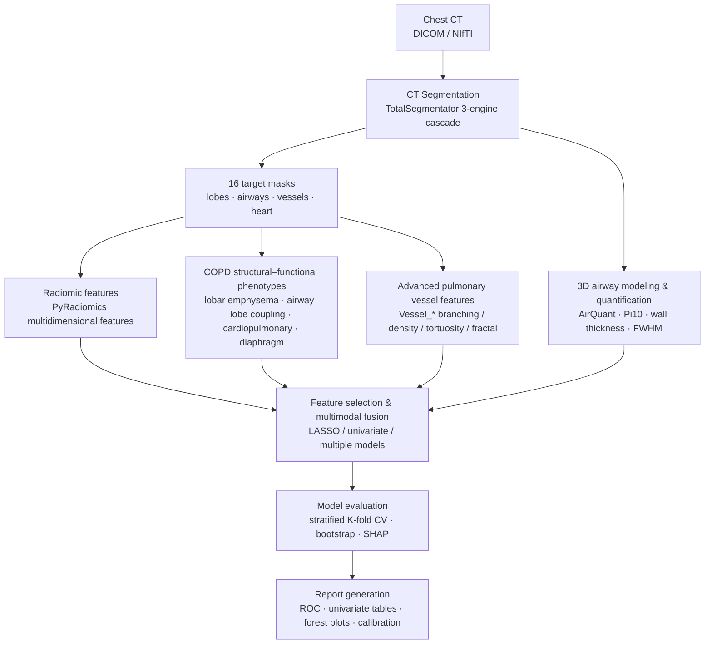

# COPD Cardiopulmonary Imaging Phenotyping & Risk Prediction

A chest CT imaging phenotyping and cardiopulmonary-event risk prediction study for chronic airway diseases (COPD / bronchiectasis / asthma). This repository implements the full computational pipeline from **CT image segmentation → radiomics & structural–functional feature extraction → multimodal fusion modeling → explainable reporting**, and is the algorithmic implementation and data-analysis component of the Beijing Natural Science Foundation – Daxing Joint Innovation Fund key project *L256014 "Integrating Cardiopulmonary Imaging with Multidimensional Clinical Features to Predict Cardiopulmonary Events in Patients with Chronic Airway Disease"*.

> **中文版**: see [README.zh-CN.md](README.zh-CN.md)

## Background & Aims

Patients with chronic airway disease carry an elevated risk of cardiovascular events and severe respiratory adverse events (collectively, **cardiopulmonary events**), yet existing risk-assessment tools have limited accuracy. Chest CT encodes rich structural and functional information about the lungs, airways, heart, and great vessels, but large-scale automated quantitative analysis is still lacking.

This project aims to:

- **Build a multimodal database** integrating chest CT imaging, pulmonary function, laboratory tests, medication, demographics, and cardiopulmonary-event outcomes;
- **Automatically extract high-throughput imaging biomarkers** — precisely segmenting lung–heart–vascular structures from chest CT and quantifying emphysema burden, small-airway remodeling, pulmonary vascular remodeling, cardiac volumes, and coronary calcium, alongside high-dimensional radiomic features;
- **Multimodal fusion modeling** combining imaging biomarkers with clinical indicators to build static and dynamic cardiopulmonary-event risk prediction models for individualized risk stratification;
- **Explainability & clinical translation** — supporting clinical decisions with interpretable analysis (feature contributions, SHAP), ultimately packaged as a cardiopulmonary risk-assessment agent embeddable in HIS/EMR.

This repository covers the core computational pipeline: **segmentation → feature extraction → modeling & evaluation → report generation**.

## Pipeline



## Methods

### 1. CT Segmentation

Fully automatic multi-structure segmentation of each patient's chest CT using a **TotalSegmentator** three-engine cascade, producing 16 "golden" targets:

- **Lung macrostructure (5)**: left upper/lower lobes, right upper/middle/lower lobes
- **Lung microstructure (2)**: pulmonary vasculature, tracheobronchial tree
- **Great vessels & trachea (3)**: aorta, pulmonary artery, trachea
- **Heart (6)**: whole heart, myocardium, left/right atria, left/right ventricles

Segmentation outputs are uniformly named and validated (`<patient>_masks/`), with a segmentation-info JSON recording the selected series, slice count, voxel spacing, etc., supporting **resume from interruption** and re-runs after failure.

### 2. Radiomic Features (PyRadiomics)

For each target region, multidimensional quantitative features are extracted with a standardized post-processing workflow (**PyRadiomics**):

- **First-order statistics**: intensity-distribution statistics
- **Shape features**: volume, surface area, maximum diameter, compactness, etc.
- **Texture features**: gray-level co-occurrence matrix (GLCM), gray-level run-length matrix (GLRLM), gray-level size-zone matrix (GLSZM), gray-level dependence matrix (GLDM), neighboring gray-tone difference matrix (NGTDM)
- **Filtered features**: wavelet, Laplacian-of-Gaussian (LoG), etc.

Features are standardized, normalized, and screened for reproducibility to ensure high stability and interpretability.

### 3. COPD Structural–Functional Phenotype Metrics

Beyond radiomics, four classes of interpretable structural–functional metrics target COPD clinical phenotypes:

| Category | Metrics | Clinical meaning |
|---|---|---|
| Lobar emphysema | per-lobe LAA-950%, Perc15, emphysema volume | emphysema burden & distribution |
| Airway–lobe coupling | airway volume fraction per lobe | small-airway disease & airflow limitation |
| Cardiopulmonary structure | pulmonary/aorta diameter ratio, RV/LV volume ratio, CAC coronary calcium volume | cor pulmonale & coronary burden |
| Diaphragm morphology | diaphragm flattening fill ratio at basal slice | hyperinflation & diaphragm function |

### 4. Airway Quantification (AirQuant / MATLAB)

Three-dimensional modeling and generation-wise quantification of the segmented tracheobronchial tree:

- **Morphology**: wall-area percentage (WA%), wall thickness, inner/outer diameter, **Pi10**, etc.
- **T/D changes**: cross-generation T/D ratio variation (std / CV / slope / outlier rate), reflecting heterogeneity of airway remodeling
- **FWHM boundary blur**: half-maximum-width-based wall density and boundary-sharpness measures, capturing pan-airway acute inflammatory remodeling
- **PCA heterogeneity**: principal-component heterogeneity of the feature matrix across the airway tree

### 5. Advanced Pulmonary Vessel Features (Vessel_*)

To replace the slow, low-specificity vessel shape features, a set of fast, interpretable pulmonary-vascular-network features was designed:

| Feature | Meaning |
|---|---|
| `Vessel_Fractal_Dim` | 3D box-counting fractal dimension (vascular complexity) |
| `Vessel_BV5_pct` / `Vessel_BV10_pct` | blood-volume fraction of small vessels with cross-section <5/10 mm² (distance-transform radius thresholds) |
| `Vessel_Skeleton_Voxels` / `_Length_mm` | centerline voxel count / length of the vascular tree |
| `Vessel_Branch / Junction / Endpoint_Count` | branch / bifurcation / endpoint counts |
| `Vessel_Branching_Density_per_mm` | bifurcation density |
| `Vessel_Tortuosity_Mean / _Max` | tortuosity (arc length / straight-line distance) |

### 6. Modeling & Evaluation

- **Feature selection**: univariate analysis (AUC / effect size) + LASSO regularization + correlation-based de-redundancy (r > 0.9)
- **Models**: logistic-regression fusion model as the backbone, extensible to XGBoost / random forest; stratified by clinical task
- **Validation**: stratified **K-fold cross-validation**, reporting AUC / sensitivity / specificity / calibration
- **Robustness**: **bootstrap** resampling to assess feature and model consistency (forest plots)
- **Interpretability**: feature coefficients, univariate contributions, and SHAP analysis

## Analysis Tasks

The pipeline has been applied to the following clinical discrimination tasks:

| Task | Description |
|---|---|
| COPD exacerbation vs stable | acute-exacerbation phenotype discrimination in pure COPD |
| BCOS phenotype | COPD with bronchiectasis vs pure COPD |
| Bronchiectasis hemoptysis | bronchiectasis with vs without hemoptysis |
| Acute vs chronic airway inflammation | acute vs stable from text-based diagnostic keywords |
| Cardiopulmonary-event feature associations | clinical associations of vascular / airway / calcium biomarkers |

Each task uniformly outputs Markdown / HTML reports (ROC curves, univariate tables, bootstrap-consistency forest plots, etc.).

## Repository Layout

```
.
├── analysis scripts/     # Python / MATLAB scripts for batch segmentation, feature extraction, modeling, reports
├── AirQuant/             # airway-quantification library (third-party, with custom quantification scripts)
├── Connectivity-Aware-Airway-Segmentaion/  # airway-segmentation model (third-party, with batch inference)
├── pulmonary-tree-labeling/                # bronchial-tree labeling (third-party)
├── AirMorph/             # airway-morphology analysis (third-party)
├── docker-airway-seg/    # containerized deployment: airway segmentation
├── docker-radiomics-seg/     # containerized deployment: segmentation + radiomics (fast)
├── docker-radiomics-full/    # containerized deployment: segmentation + radiomics (full)
├── tests/                # test cases (with small anonymized test data)
└── README.md
```

> Data, model weights, and third-party sub-repositories are not distributed with this repository; please prepare them for your deployment environment.

## Dependencies

- **Python 3.10**: PyRadiomics 3.0.1, SimpleITK, scikit-image, SciPy, NumPy, pandas, scikit-learn, matplotlib, edt, nibabel, TotalSegmentator
- **MATLAB**: AirQuant airway quantification (optional)
- **PyTorch + CUDA**: deep-learning segmentation of airways / heart (optional, GPU-accelerated)

## Engineering Notes

- Mind memory usage in large 3D computations: use `edt` (float32) instead of SciPy float64 for distance transforms; use int32 for fractal box-counting; avoid large-buffer 3D `scipy.ndimage.convolve` allocations.
- Prevent **label leakage** during feature selection: exclude the label column case-insensitively.
- Convert NumPy types from nibabel / PyRadiomics to native Python types before JSON serialization.

## Citation & Acknowledgement

This work is supported by the Beijing Natural Science Foundation – Daxing Joint Innovation Fund key project **L256014 (Integrating Cardiopulmonary Imaging with Multidimensional Clinical Features to Predict Cardiopulmonary Events in Patients with Chronic Airway Disease)**.

---

**Disclaimer**: This repository contains algorithms and code only, with no patient privacy data; medical imaging data must be used in compliance with ethics and data-security requirements.
