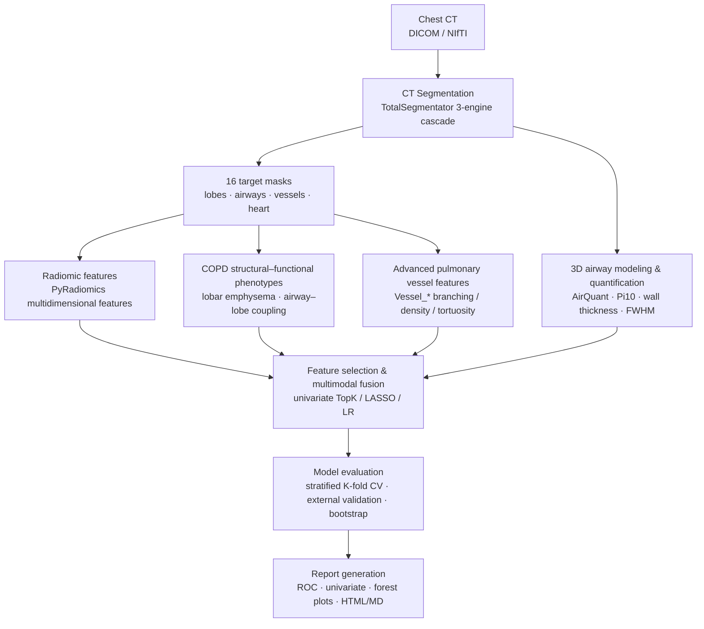

# COPD Cardiopulmonary Imaging Phenotyping & Risk Prediction

A chest CT imaging phenotyping and cardiopulmonary-event risk prediction study for chronic airway diseases (COPD / bronchiectasis / asthma). This repository implements the full computational pipeline from **CT segmentation → radiomics & structural–functional feature extraction → multimodal fusion modeling → explainable reporting**, for the Beijing Natural Science Foundation – Daxing Joint Innovation Fund project *L256014*.

> **本文件为仓库索引（Repository Index）。** 完整研究说明与分析脚本分别位于 `docs/` 与 `Analysis/`。

## 📌 Quick Links / 快速导航

| 链接 | 内容 |
|---|---|
| 📖 **研究说明 / Study overview** | [docs/README.md](docs/README.md) — 队列 / 标签口径 / 特征工程 / 方法 / 结果汇总 / 结论局限 |
| 🧪 **分析脚本与使用规范** | [Analysis/README.md](Analysis/README.md) — 22 个正式可复用脚本、用法、执行流程 ①→⑦ |
| 🇨🇳 **中文版** | [README.zh-CN.md](README.zh-CN.md) |

## 📂 Repository Structure

```
copd-radiomics/
├── docs/                      # 研究说明文档（队列/方法/结果/局限）
├── Analysis/                  # 正式分析脚本（标签、整合、对齐、外验、报告）+ README
├── *.py                       # 流水线脚本：分割 / radiomics / 气道 / 血管 / 标签 / 报告
├── Rscripts/                  # R 分析脚本（KM / glmnet / svm 等）
├── AirQuant/  AirMorph/  docker-*/  ...   # 第三方工具 / 子模块 / 容器化部署
├── README.md                  # 本索引
└── README.zh-CN.md / LICENSE
```

## 🔬 Pipeline (overview)



## 🗂 Where to Find Things

- **分析脚本**：`Analysis/`（每个脚本头部有 `用法:`，完整规范见 `Analysis/README.md`）
- **研究说明**：`docs/README.md`
- **输出报告**（本机）：`E:\DICOM\reports\`（综合报告 `report_COPD_final.html` 等，HTML 自包含）
- **数据**：特征表在 `E:\DICOM\2026-0x-seg\`，标签/ICD 源在各序列目录（详见 docs）

## Dependencies

- **Python 3.10**: PyRadiomics 3.0.1, SimpleITK, scikit-image, SciPy, NumPy, pandas, scikit-learn, matplotlib, edt, nibabel, TotalSegmentator
- **MATLAB**: AirQuant airway quantification (optional)
- **PyTorch + CUDA**: deep-learning segmentation (optional)

## Citation / License

Supported by Beijing Natural Science Foundation – Daxing Joint Innovation Fund key project **L256014**. See [LICENSE](LICENSE). 数据与模型权重不入库，请自行准备部署环境；医学影像数据须合规使用。
