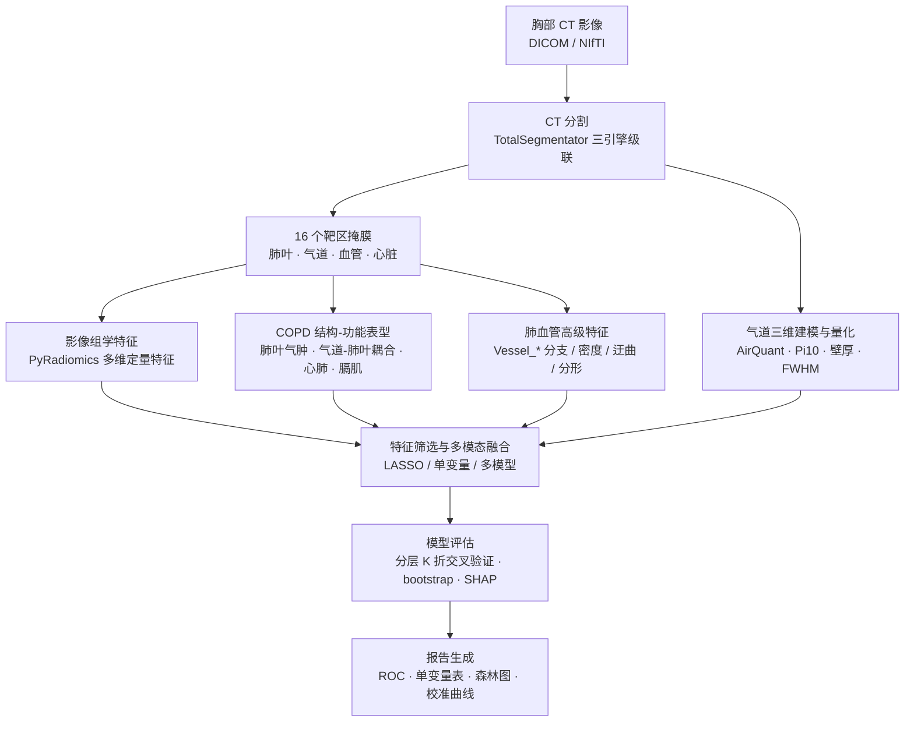

# COPD 心肺影像表型分析与心肺事件智能预测

面向慢性气道疾病（慢阻肺 / 支气管扩张 / 哮喘）的胸部 CT 影像表型分析与心肺事件风险预测研究。本仓库实现了从 **CT 图像分割 → 影像组学 / 结构-功能特征提取 → 多模态融合建模 → 可解释报告** 的完整计算管线，是北京市自然科学基金-大兴创新联合基金重点项目 *L256014「融合心肺影像与多维临床特征的慢性气道疾病患者心肺事件智能预测模型研究」* 的算法实现与数据分析部分。

> **English**: 请参见 [README.md](README.md)

## 项目背景与目的

慢性气道疾病患者常合并较高的心血管事件与严重呼吸系统不良事件（合称**心肺事件**）风险，而现有风险评估工具的准确性有限。胸部 CT 蕴含肺、气道、心脏与大血管的丰富结构与功能信息，但尚缺大规模、自动化的定量分析方法。

本项目旨在：

- **构建多模态数据库**：整合胸部 CT 影像、肺功能、实验室检验、用药与人口学等多维临床表型及心肺事件结局；
- **自动高通量影像标志物提取**：从胸部 CT 精准分割肺-心-血管结构，自动量化肺气肿负荷、小气道重塑、肺血管重构、心脏体积与冠脉钙化等指标，并提取高维影像组学特征；
- **多模态融合建模**：融合影像标志物与临床指标，构建静态与动态心肺事件风险预测模型，实现个体化风险分层；
- **可解释与临床转化**：以可解释分析（特征贡献、SHAP）支撑临床决策，最终封装为可嵌入 HIS/EMR 的心肺风险评估智能体。

本仓库覆盖其中的核心计算管线：**影像分割 → 特征提取 → 建模评估 → 报告生成**。

## 技术路线



## 方法

### 1. 影像分割（CT Segmentation）

对每位患者的胸部 CT 进行全自动多结构分割，采用 **TotalSegmentator** 三引擎级联，输出 16 个「黄金靶区」：

- **肺部宏观结构（5）**：左肺上/下叶、右肺上/中/下叶
- **肺部微观结构（2）**：肺血管网、气管-支气管树
- **大血管与气管干（3）**：主动脉、肺动脉、气管
- **心脏（6）**：整体心脏、心肌、左/右心房、左/右心室

分割结果经统一命名与校验（`<患者>_masks/`），并记录分割信息 JSON（含选中序列、层数、体素间距等），支持**断点续传**与失败重跑。

### 2. 影像组学特征（PyRadiomics）

对每个靶区使用标准化后处理流程（**PyRadiomics** 平台）提取多维定量特征：

- **一阶灰度统计**（first order）：强度分布统计量
- **形状特征**（shape）：体积、表面积、最大径、致密性等几何形态
- **纹理特征**（texture）：灰度共生矩阵（GLCM）、灰度游程矩阵（GLRLM）、灰度大小区域矩阵（GLSZM）、灰度依赖矩阵（GLDM）、邻域灰度差分矩阵（NGTDM）
- **滤波特征**：小波（wavelet）、拉普拉斯高斯（LoG）等

同时进行特征标准化、归一化与重复性筛选，保证输入特征的高稳定性与可解释性。

### 3. COPD 结构-功能表型指标

在影像组学之外，针对 COPD 临床表型构建四类可解释的结构-功能指标：

| 类别 | 指标 | 临床意义 |
|---|---|---|
| 肺叶气肿 | 各肺叶 LAA-950%、Perc15、气肿容积 | 肺气肿负荷与分布 |
| 气道-肺叶耦合 | 各肺叶内气道容积占比 | 小气道病变与气流受限 |
| 心肺结构 | 肺动脉/主动脉直径比、右室/左室容积比、CAC 冠脉钙化容积 | 肺心病与冠脉负荷 |
| 膈肌形态 | 底部层面膈肌扁平化填充比 | 过度充气与膈肌功能 |

### 4. 气道量化（AirQuant / MATLAB）

基于分割出的气管-支气管树进行三维建模与逐代量化：

- **形态学**：管壁面积百分比（WA%）、壁厚、内/外径、**Pi10** 等
- **T/D 变化**：跨代 T/D 比值突变（标准差 / CV / 斜率 / 离群率），刻画气道重塑的不均质性
- **FWHM 边界模糊**：基于半峰宽的管壁密度与边界锐度测量，刻画泛气道急性炎症重塑
- **PCA 异质性**：跨气道树特征矩阵的主成分异质性

### 5. 肺血管高级特征（Vessel_*）

为替代高耗时、低特异性的血管 shape 特征，设计了一组极速、可解释的肺血管网络特征：

| 特征 | 含义 |
|---|---|
| `Vessel_Fractal_Dim` | 3D 计盒分形维度（血管网复杂度） |
| `Vessel_BV5_pct` / `Vessel_BV10_pct` | 截面积 <5/10 mm² 小血管血容量占比（基于距离变换半径阈值） |
| `Vessel_Skeleton_Voxels` / `_Length_mm` | 血管树中心线体素数 / 长度 |
| `Vessel_Branch / Junction / Endpoint_Count` | 分支数 / 分叉点数 / 端点数 |
| `Vessel_Branching_Density_per_mm` | 分支点密度 |
| `Vessel_Tortuosity_Mean / _Max` | 迂曲度（弧长 / 直线距离） |

### 6. 建模与评估

- **特征筛选**：单变量分析（AUC / 效应量）+ LASSO 正则化 + 相关性去冗余（r > 0.9）
- **模型**：以 **Logistic 回归** 融合模型为主干，可扩展至 XGBoost / 随机森林等；按临床任务分层
- **验证**：分层 **K 折交叉验证**，报告 AUC / 灵敏度 / 特异度 / 校准
- **稳健性**：**bootstrap** 重采样评估特征与模型的一致性（森林图）
- **可解释性**：特征系数、单变量贡献与 SHAP 分析

## 分析任务

当前管线已用于以下临床判别任务：

| 任务 | 说明 |
|---|---|
| COPD 急性加重 vs 稳定期 | 纯 COPD 患者急性加重表型判别 |
| BCOS 表型 | 慢阻肺合并支气管扩张 vs 单纯慢阻肺 |
| 支扩咯血 | 支气管扩张伴咯血 vs 无咯血 |
| 急慢性气道炎症 | 基于文本诊断关键词的急性 vs 稳定 |
| 心肺事件相关特征关联 | 肺血管 / 气道 / 钙化等标志物的临床关联 |

各任务统一输出 Markdown / HTML 报告（ROC 曲线、单变量表、bootstrap 一致性森林图等）。

## 目录结构

```
.
├── 分析脚本/           # 批量分割、特征提取、建模、报告等 Python / MATLAB 脚本
├── AirQuant/           # 气道量化库（第三方，含自定义量化脚本）
├── Connectivity-Aware-Airway-Segmentaion/  # 气道分割模型（第三方，含批量推理）
├── pulmonary-tree-labeling/                # 支气管树标记（第三方）
├── AirMorph/            # 气道形态分析（第三方）
├── docker-airway-seg/   # 容器化部署：气道分割
├── docker-radiomics-seg/    # 容器化部署：分割 + 影像组学（快速版）
├── docker-radiomics-full/   # 容器化部署：分割 + 影像组学（全量版）
├── tests/               # 测试用例（含小型匿名测试数据）
└── README.md
```

> 数据、模型权重与第三方子仓库不随本仓库分发，请根据实际部署环境另行准备。

## 环境依赖

- **Python 3.10**：pyRadiomics 3.0.1、SimpleITK、scikit-image、scipy、numpy、pandas、scikit-learn、matplotlib、edt、nibabel、TotalSegmentator
- **MATLAB**：AirQuant 气道量化（可选）
- **PyTorch + CUDA**：气道 / 心脏深度学习分割模型（可选，GPU 加速）

## 工程要点（经验）

- 大容积 3D 计算注意内存：距离变换用 `edt`（float32）而非 scipy float64；分形 boxcount 用 int32；避免 scipy `ndi.convolve` 3D 大缓冲分配。
- 特征筛选需防止**标签泄漏**：标签列须大小写不敏感地排除出特征集。
- nibabel / PyRadiomics 输出的 numpy 类型需先转换为 Python 原生类型再序列化 JSON。

## 引用与致谢

本工作受北京市自然科学基金-大兴创新联合基金重点项目 **L256014（融合心肺影像与多维临床特征的慢性气道疾病患者心肺事件智能预测模型研究）** 支持。

---

**免责声明**：本仓库仅包含算法与代码实现，不含患者隐私数据；医学影像数据需在符合伦理与数据安全要求的条件下使用。
